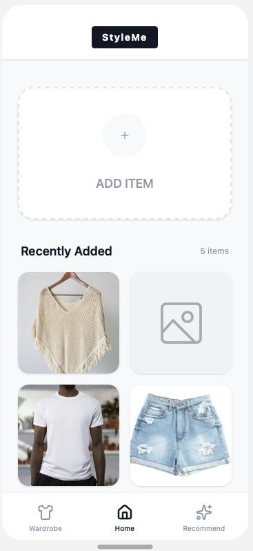
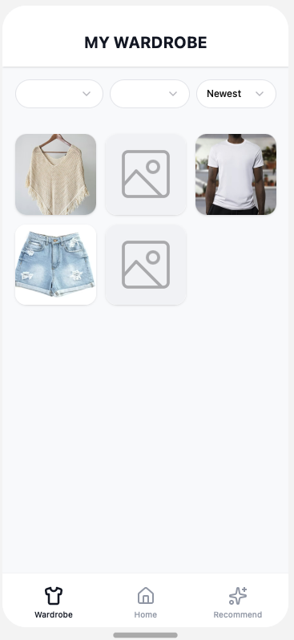
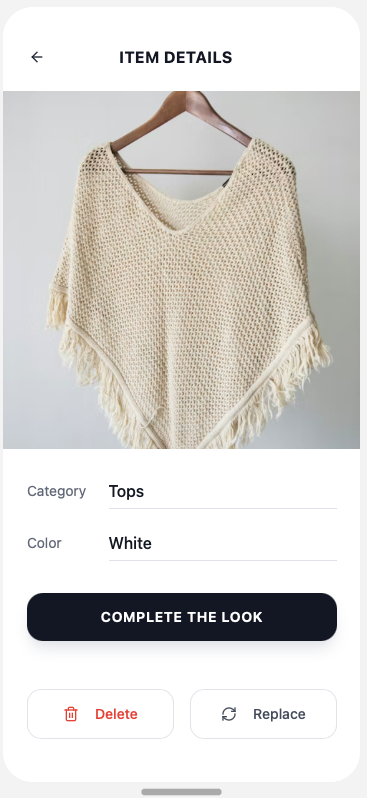
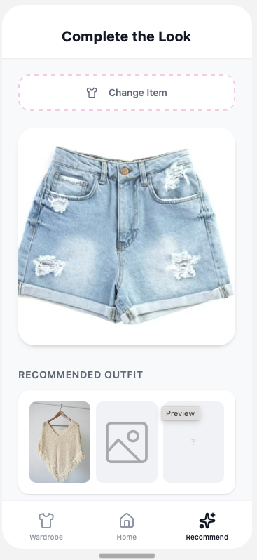

# Solution Architecture

## System Overview
StyleMe 9.0 is a containerized microservices system with four services  
(ingestion, preprocessing, training, and inference) connected via a Docker
network and runnable independently or as a full pipeline with Docker Compose.

## Data Flow
Source data (~13k product images + JSON) resides in Google Cloud Storage (GCS)  
and is transformed into triplet datasets for model training. After training,  
the system generates 512-D normalized embeddings for catalog and user wardrobe
items and persists them in FAISS indexes for fast similarity search.

## Recommendation Flow
For a query item, the inference service embeds the image and first searches
the user’s wardrobe FAISS index. If no result exceeds a 0.7 similarity
threshold (or no candidates exist), it falls back to the global catalog
FAISS index. Responses include product metadata (title, brand, price, URL) and
apply category-diversity filtering; optional filters (e.g., gender) can be
applied as needed.

## Frontend Experience

A mobile-first SPA built with React, TypeScript, Vite, Tailwind CSS, and Radix
UI provides onboarding, a home dashboard with **Add Item**, a wardrobe-by-category
view, item details with *Complete the Look*, and a recommendations screen.  
The frontend communicates with preprocessing and inference endpoints over HTTPS
to upload images, trigger indexing, and fetch recommendations, and implements
clear loading/empty/error states and accessible UI patterns.

### Screenshots

The following screenshots demonstrate the key screens and user experience of the StyleMe application:

#### Onboarding Screen

#### Home Screen

#### Wardrobe Screen

#### Item Details Screen

#### Recommendation Screen

## Storage & Reproducibility
Raw sources remain in GCS, while artifacts (catalog/user FAISS indexes, Parquet
metadata, and model checkpoints) are versioned with DVC. GCS source state is
tracked with `manifest.json` snapshots to ensure reproducibility.

# Technical Architecture

## Core Tech Stack
- Python 3.10+
- PyTorch 2.1.2+ (CUDA)
- Transformers (Hugging Face CLIP)
- FAISS
- Docker / Docker Compose  

Services communicate over the Docker network; shared volumes mount experiments,
catalog, wardrobes, and logs.

## Model & Training Settings
The core model is FashionCLIP (CLIP ViT-B/32) fine-tuned with triplet loss
(margin 0.5) for compatibility. The first four transformer layers are frozen;
remaining layers are trainable. Optimization uses AdamW (lr = 2e-5) with a
cosine-annealing scheduler, early stopping, and batch sizes of 32–64.

## Retrieval & Search
Similarity search uses FAISS over 512-D embeddings with cosine similarity.
The inference service is stateless, auto-detects CPU/GPU, loads the active
checkpoint and indexes, and applies the wardrobe-first, catalog-fallback
strategy plus category diversity (and optional filters) during ranking.

## APIs & Interfaces

### Inference Service

The inference layer exposes a Python API (`InferenceService`) with:

- `embed_image(image_path)` – generates 512-D normalized embeddings from images
- `search_wardrobe(user_id, query_embedding, k)` – searches user's personal wardrobe FAISS index
- `search_catalog(query_embedding, k, gender)` – searches global catalog FAISS index
- `inference(user_id, query_image_path, ...)` – orchestrates wardrobe-first, catalog-fallback search and returns JSON recommendations

For web integration, a **Flask-based REST API** (`api_server.py`) wraps the `InferenceService` and provides the following HTTP endpoints:

- `GET /health` – health check endpoint
- `POST /api/upload` – upload images to user's wardrobe (supports base64 and multipart/form-data)
- `POST /api/recommend` – get style recommendations for a query image
- `GET /api/wardrobe/<user_id>` – retrieve user's wardrobe items
- `GET /api/wardrobe/<user_id>/image/<filename>` – serve wardrobe images
- `POST /api/wardrobe/<user_id>/rebuild` – rebuild user's wardrobe FAISS index

The API server runs on port 5000 (configurable via `PORT` environment variable) and is enabled with the `RUN_API_SERVER` environment variable. CORS is enabled for frontend communication.

### Preprocessing Service

The preprocessing service runs as a **batch processing pipeline** (via `entrypoint.sh`) that performs background removal and image preprocessing. It processes data from the shared data directory and does not expose HTTP endpoints. Background removal is integrated into the inference pipeline when processing uploaded wardrobe images.

### Ingestion Service

The ingestion service runs as a **batch processing script** (via `entrypoint.sh`) that loads catalog data from Google Cloud Storage (GCS) into the shared data directory. It copies JSON metadata and images to the local filesystem for processing by downstream services. The service does not expose HTTP endpoints and is orchestrated via Docker Compose.

### Training Service

The training service runs as a **batch processing pipeline** (via `entrypoint.sh`) that executes model fine-tuning jobs. It processes training data from the shared data directory and saves model checkpoints to the experiments directory. The service does not expose HTTP endpoints for job submission or status; training is triggered via Docker Compose orchestration or direct script execution.

## Infrastructure & Configuration
Docker Compose orchestrates services with shared volumes; the training service
uses GPU resources (NVIDIA CUDA) with ~2GB shared memory, and inference
auto-detects CPU/GPU. Configuration relies on environment variables (e.g.,
GCS bucket, project ID, data prefixes) to avoid hard-coded credentials and
support flexible, secure deployments.

## Design Patterns
Microservice isolation defines clear service boundaries; dependency injection
is implemented via environment variables; factory patterns are used for
dataset/model construction; and a strategy pattern powers the two-tier search
(flow from wardrobe to catalog) with a thresholded fallback.
